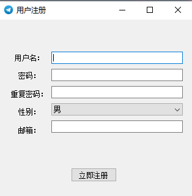

### Telegraph

##### Loginthread模块：负责登录业务。

业务流程：`startConnect` 作为登录触发插槽，启动socket。绑定socket的 `connected`和 `disconnected` 信号，对应处理函数 `socket_Connected`和 `socket_Disconnected`

* `startConnect` ：登录业务处理函数，连接服务器，监听连接信号。
* `socket_Connected` ：1）开启监听信息接收，绑定 `socket_Read_Data ` 信号；2）发送登录账号密码。
* `socket_Read_Data` ：登录信息接收处理，对应触发主窗口信号。

##### MainWindow模块：主业务

业务流程：

1. 登陆业务：创建线程，初始化登录模块，绑定线程。线程开始信号 `startThread` 绑定 `startConnect` ，绑定登录业务结果 `loginFailed` 和 `loginSuccess`。
2. 注册业务：类似登录业务，在主线程进行。

##### RegWindow模块：负责注册业务

### Server
